<div align="center">

```
███╗   ██╗██╗███████╗██╗  ██╗ ██████╗██╗  ██╗ █████╗ ██╗
████╗  ██║██║██╔════╝██║  ██║██╔════╝██║  ██║██╔══██╗██║
██╔██╗ ██║██║███████╗███████║██║     ███████║███████║██║
██║╚██╗██║██║╚════██║██╔══██║██║     ██╔══██║██╔══██║██║
██║ ╚████║██║███████║██║  ██║╚██████╗██║  ██║██║  ██║███████╗
╚═╝  ╚═══╝╚═╝╚══════╝╚═╝  ╚═╝ ╚═════╝╚═╝  ╚═╝╚═╝  ╚═╝╚══════╝
```


<br/>

[](https://linkedin.com)
[](https://github.com)
[](https://huggingface.co)
[](https://kaggle.com)

</div>

---

## 🧠 AI Knowledge Graph

> My expertise as an interconnected knowledge system — just like the graphs I build.

```mermaid
graph TD
    ME((🧑‍💻 Nishchal)) --> LLM[🤖 LLM Engineering]
    ME --> KG[🕸️ Knowledge Graphs]
    ME --> CV[👁️ Computer Vision]
    ME --> MLO[⚙️ MLOps]

    LLM --> RAG[RAG Pipelines]
    LLM --> FT[Fine-tuning\nLoRA · QLoRA]
    LLM --> AGT[Agentic Systems\nLangGraph · CrewAI]
    LLM --> PROM[Prompt Engineering\n& Evaluation]

    KG --> NEO[Neo4j · Cypher]
    KG --> NLP2[NLP Entity Extraction]
    KG --> EMB[Graph Embeddings\nNode2Vec · GraphSAGE]
    KG --> KGRAG[KG-RAG Fusion 🔥]

    CV --> OBJ[Object Detection\nYOLO · DETR]
    CV --> SEG[Segmentation\n& OCR]
    CV --> VLM[Vision-Language\nModels · CLIP]

    MLO --> VDB[Vector Databases\nPinecone · Weaviate]
    MLO --> EXP[Experiment Tracking\nMLflow · W&B]
    MLO --> SERVE[Model Serving\nFastAPI · Triton]
    MLO --> PIPE[Data Pipelines\nAirflow · dbt]

    style ME fill:#00D9FF,color:#000,stroke:#00D9FF,font-weight:bold
    style KG fill:#7C3AED,color:#fff,stroke:#7C3AED
    style KGRAG fill:#7C3AED,color:#fff,stroke:#fff,stroke-width:2px,stroke-dasharray:4
    style LLM fill:#059669,color:#fff,stroke:#059669
    style CV fill:#DC2626,color:#fff,stroke:#DC2626
    style MLO fill:#D97706,color:#fff,stroke:#D97706
```



---

## 🚀 About Me

```python
nishchal = {
    "role"        : "AI/ML Engineer & Knowledge Graph Expert",
    "building"    : ["KG-augmented RAG systems", "Agentic AI pipelines", "Multimodal AI apps"],
    "researching" : ["Graph Neural Networks", "LLM reasoning", "Autonomous Agents"],
    "mastered"    : ["Knowledge Graph construction & querying", "RAG architecture design"],
    "superpower"  : "Connecting unstructured data → structured knowledge → AI reasoning 🕸️",
    "open_to"     : ["AI/ML engineering roles", "Research collaborations", "Open source"]
}
```

---

## 🛠️ Full AI Stack

<div align="center">

### 🤖 LLM & Generative AI


### 🕸️ Knowledge Graphs *(Expert)*


### 🏗️ Agentic & RAG Systems


### 🔢 Vector Databases & Embeddings


### 👁️ Computer Vision & Multimodal


### ⚙️ MLOps & Infrastructure


### 🐍 Core Languages & Tools


</div>

---

## 🏆 Signature Projects

<table>
<tr>
<td width="50%">

### 🕸️ KG-RAG Hybrid System
> Knowledge Graph + RAG pipeline for multi-hop reasoning over enterprise documents

**Stack:** Neo4j · LangGraph · GPT-4 · Weaviate  
**Highlights:**
- Entity extraction & relation linking at scale
- Graph traversal for multi-hop Q&A
- 40% better factual accuracy vs naive RAG

</td>
<td width="50%">

### 🤖 Autonomous Research Agent
> Multi-agent system that plans, searches, synthesizes & cites research papers

**Stack:** CrewAI · Claude · Qdrant · Arxiv API  
**Highlights:**
- Tool-using agents with memory & reflection
- Dynamic knowledge graph construction
- Auto-generates structured research briefs

</td>
</tr>
<tr>
<td width="50%">

### 👁️ Multimodal Document Intelligence
> Vision + Language pipeline for extracting knowledge from PDFs, images & tables

**Stack:** CLIP · GPT-4V · LlamaIndex · ChromaDB  
**Highlights:**
- OCR + layout understanding
- Cross-modal retrieval
- KG population from unstructured docs

</td>
<td width="50%">

### 🔗 Graph Neural Network — Link Prediction
> GNN-based link prediction for recommender systems and KG completion

**Stack:** PyTorch Geometric · Neo4j · GraphSAGE  
**Highlights:**
- Node2Vec & GraphSAGE embeddings
- TransE/RotatE relation modeling
- KGCN-based recommendation layer

</td>
</tr>
</table>

---

## 📊 GitHub Stats

<div align="center">


</div>

<div align="center">

</div>

---

## 🌐 Currently Exploring

```bash
$ nishchal --current-research

[1/5] ██████████ Graph-of-Thoughts prompting for multi-hop reasoning
[2/5] ████████░░ Speculative decoding & efficient LLM inference
[3/5] ███████░░░ Temporal Knowledge Graphs for dynamic world models  
[4/5] ██████░░░░ Mixture-of-Experts architectures (MoE)
[5/5] █████░░░░░ AI Agents with persistent memory & tool-use planning
```

---

## 🤝 Let's Build Together

<div align="center">

I'm especially excited about:

🕸️ **Knowledge Graph + LLM fusion** &nbsp;|&nbsp; 🤖 **Agentic AI systems** &nbsp;|&nbsp; 🔬 **AI Research**

[](mailto:nishchal@email.com)
[](https://linkedin.com)
[](https://x.com)

<br/>


<br/>

```
"The goal is to turn data into information,
 information into insight, insight into knowledge,
 and knowledge into intelligence."
                         — The Knowledge Graph Engineer's Creed
```

</div>
